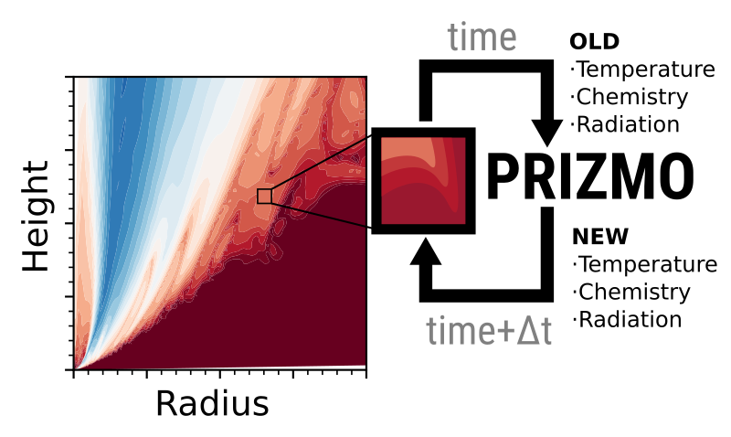

# PRIZMO
- PRIZMO is a library-like code to advance time-dependent chemistry and temperature of a protoplanetary disk (M)HD simulation.
- It preprocesses the input information to write optimized FORTRAN code.
- It has a C interface that allows it to be coupled with codes like PLUTO.
- The earlier code is described in [https://arxiv.org/abs/2004.04748] (Grassi et al. 2020)
- The newer version is discussed in [https://arxiv.org/abs/2408.00848] (Sellek et al. 2024)



## Quickstart
- Clone the repository
```
git clone git@github.com:tgrassi/prizmo.git
cd prizmo
```

- Create a virtual environment (optional, but recommended)
```
pip install virtualenv
python -m venv env
source env/bin/activate
```

- Install requirements
```
pip install -r requirements.txt
```

- Run the preprocessor
```
cd src_py
python prizmo.py
cd ..
```

- Choose a model
```
cp models/disk/* .
```

- Compile the code
```
make
```

- Run the code
```
./test
```

- Plot the results      
Open another terminal while the code is running...     
```
python plot_jobs.py 10
```
where `10` is the number of processors you want to use for plotting.   
It will create a set of PNG files for each time-step `plot_000000.png`, `plot_000001.png`, ...      

## Preprocessor
Preprocessing is needed:

* After cloning this repository
* When changing chemistry (i.e., changing chemical network)
* After changing data in the `data` folder
* When changing dust or radiation parameters in `src_py/prizmo_commons.py`

How to preprocess:
```
cd src_py
python prizmo.py
```
wait...

### How to change the preprocessor inputs (e.g., radiation, dust properties, ...)
PRIZMO's preprocessor has default values for many choices. However, these can be configured by the user either by passing an input file with the flag -i (see test.ini for an example), or by setting any of the following command line arguments directly:
* chemNet - the chemical network specified as a list of reactions
* atomData - the file containing the details of level energies and fits for the de-excitation rates for the atomic cooling
* radiation_type - details of the spectrum to use
* nphoto - the number of energy bins to use
* energy_minmax - the minimum and maximum energies to use (eV)
* dust_minmax - the minimum and maximum dust grain sizes to use (cm)
* refInd_file - the file containing the refractive indices for the dust
The command line arguments that were used are logged in a readme file in the runtime_data folder

Note: When you change radiation or dust properties, it is recommended that the contents of the runtime_data folder be deleted!
This also applies if you experience weird behaviors during the runtime stage.

## Compile and run
### Call from Fortran
The example `models/disk/main.f90` is written in FORTRAN and simulates a static disk.    

```
cp models/disk/* .
make
./test
python plot.py 1
```
The makefile automatically searches for the Intel Fortran compiler (ifx), otherwise uses `gfortran` (not tested).    

### Call from C
The example test `models/cbind/main_c.c` evolves a single cell, and it is intended to show how to call PRIZMO from C.
```
cp models/cbind/* .
make cbind
./test
python plot.py
```
The makefile automatically searches for Intel Fortran (ifx) and C (icx) compilers.    


## Known bugs/errors/warnings
#### Missing XUVTOP warning
Ignore it unless you want to produce new cooling tables using CHIANTI.    
Download the latest CHIANTI release [https://www.chiantidatabase.org/chianti_download.html].     
Export the path of where you unzipped the data (the folder containing the atom folders), e.g.
```
export XUVTOP=~/chianti
```
#### Early segmentation fault    
Segmentation fault at the beginning when running `./test`.       
PRIZMO uses large tables (especially atomic cooling), hence you need to increase the stack size to 
```
ulimit -s unlimited
```
#### DLSODES warnings
Warnings similar to this, but the code continues to run    
```
 DLSODES- At current T (=R1), MXSTEP (=I1) steps             
       taken on this call before reaching TOUT               
      In above message,  I1 =     10000
      In above message,  R1 =  0.5040993677130D+03
```
The solver is taking too many iterations to advance, but the solution is found anyway.    
The cell is probably close to thermochemical equilibrium.     
Ignore it if you don't have any clear strategy on how to improve the convergence (e.g., producing finer tables, changing tolerances). 


#### MAXSTEPS warning
Message `WARNING: MAXSTEPS with oscillating solution`.   
Ignore, the solver is oscillating around the thermochemical equilibrium, hence it stops the integration earlier to avoid useless calculations.   

## How to cite
```
@ARTICLE{2024A&A...690A.296S,
       author = {{Sellek}, A.~D. and {Grassi}, T. and {Picogna}, G. and {Rab}, Ch. and {Clarke}, C.~J. and {Ercolano}, B.},
        title = "{Photoevaporation of protoplanetary discs with PLUTO+PRIZMO: I. Lower X-ray{\textendash}driven mass-loss rates due to enhanced cooling}",
      journal = {\aap},
     keywords = {astrochemistry, hydrodynamics, methods: numerical, protoplanetary disks, stars: winds, outflows, X-rays: stars, Astrophysics - Earth and Planetary Astrophysics},
         year = 2024,
        month = oct,
       volume = {690},
          eid = {A296},
        pages = {A296},
          doi = {10.1051/0004-6361/202450171},
archivePrefix = {arXiv},
       eprint = {2408.00848},
 primaryClass = {astro-ph.EP},
       adsurl = {https://ui.adsabs.harvard.edu/abs/2024A&A...690A.296S},
      adsnote = {Provided by the SAO/NASA Astrophysics Data System}
}
```
and    
```
@ARTICLE{2020MNRAS.494.4471G,
       author = {{Grassi}, T. and {Ercolano}, B. and {Sz{\H{u}}cs}, L. and {Jennings}, J. and {Picogna}, G.},
        title = "{Modelling thermochemical processes in protoplanetary discs I: numerical methods}",
      journal = {\mnras},
     keywords = {astrochemistry, radiative transfer, methods: numerical, ISM: evolution, photodissociation region, Astrophysics - Earth and Planetary Astrophysics, Astrophysics - Solar and Stellar Astrophysics},
         year = 2020,
        month = may,
       volume = {494},
       number = {3},
        pages = {4471-4491},
          doi = {10.1093/mnras/staa971},
archivePrefix = {arXiv},
       eprint = {2004.04748},
 primaryClass = {astro-ph.EP},
       adsurl = {https://ui.adsabs.harvard.edu/abs/2020MNRAS.494.4471G},
      adsnote = {Provided by the SAO/NASA Astrophysics Data System}
}


```

